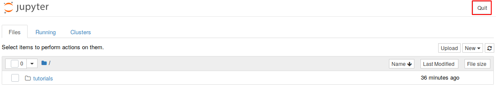

# TotemBionet

## Quick usage guide

You need [Docker](http://docker.com).
Dockers is supported on GNU/Linux, macOS, and Windows.

Note: You may need to use sudo for the following commands, check [the official page](https://docs.docker.com/install/linux/linux-postinstall/) for more information.

First, build the docker image by executing in a terminal:

    ./install.sh

Then, start the docker container by executing:

    ./run.sh

Then, open your browser and go to http://localhost:8888 for the Jupyter notebook web interface.  
The container can be stopped by pressing <kbd>Ctrl+C</kbd> keys or by using the `Quit` button in the Jupyter interface.

